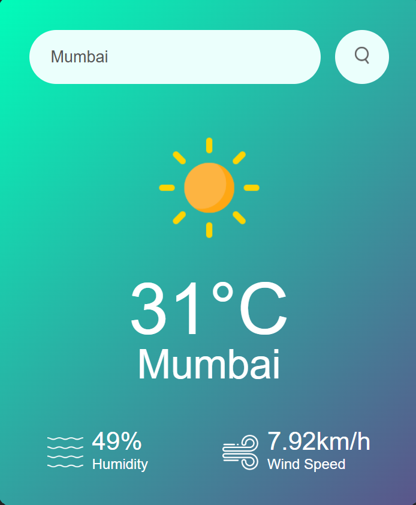
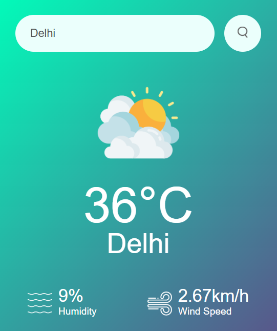

# 🌤️ Weather App

A clean and responsive weather app built with HTML, CSS, and JavaScript that fetches real-time weather data using the OpenWeatherMap API.

---

## 📸 Screenshots

<p align="center">
  
  &nbsp;
  
</p>

---

## 🚀 Features

- 🔍 Search weather by city name
- 🌡️ Displays real-time temperature in °C
- 💧 Shows humidity percentage
- 💨 Shows wind speed in km/h
- 🌦️ Dynamic weather icons based on conditions (Clouds, Clear, Rain, Drizzle, Mist, Snow)
- ⚠️ Error handling for invalid city names
- 📱 Responsive design for all screen sizes

---

## 🛠️ Built With

| Technology | Usage |
|------------|-------|
| HTML5 | Structure & layout |
| CSS3 | Styling & responsiveness |
| JavaScript (Vanilla) | API calls & DOM manipulation |
| [OpenWeatherMap API](https://openweathermap.org/api) | Real-time weather data |

---

## 📂 Project Structure

```
weather-website/
├── index.html              # Main app file
├── asset/
│   ├── style.css           # Stylesheet
│   └── image/
│       ├── search.png      # Search button icon
│       ├── humidity.png    # Humidity icon
│       ├── wind.png        # Wind icon
│       ├── clouds.png      # Clouds weather icon
│       ├── clear.png       # Clear sky icon
│       ├── rain.png        # Rain icon
│       ├── drizzle.png     # Drizzle icon
│       ├── mist.png        # Mist icon
│       └── snow.png        # Snow icon
└── sceenshots/
    ├── Mumbai.png
    └── Delhi.png
```

---

## ⚙️ Getting Started

### Prerequisites

- A web browser
- A free API key from [OpenWeatherMap](https://openweathermap.org/api)

### Run Locally

1. **Clone the repository**
   ```bash
   git clone https://github.com/NainaKothari-14/weather-website.git
   ```

2. **Navigate into the project folder**
   ```bash
   cd weather-website
   ```

3. **Add your API key**  
   Open `index.html` and replace the `apiKey` value with your own:
   ```js
   const apiKey = "your_api_key_here";
   ```

4. **Open `index.html` in your browser**  
   Just double-click the file — no server needed!

---

## 🌦️ Supported Weather Conditions

| Condition | Icon Used |
|-----------|-----------|
| Clouds | `clouds.png` |
| Clear | `clear.png` |
| Rain | `rain.png` |
| Drizzle | `drizzle.png` |
| Mist | `mist.png` |
| Snow | `snow.png` |

---

## 👩‍💻 Author

**Naina Kothari**  
GitHub: [@NainaKothari-14](https://github.com/NainaKothari-14)
